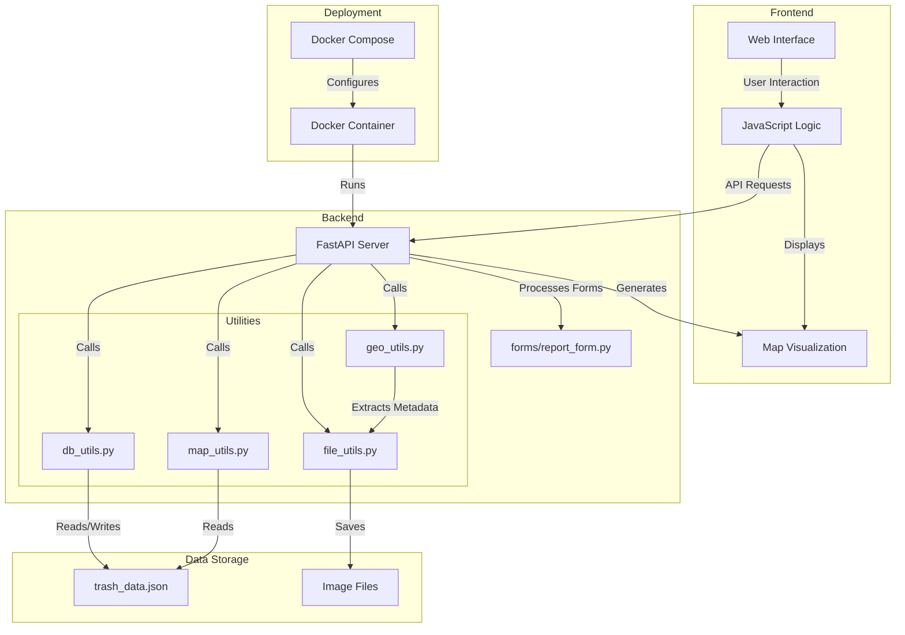

# Trash Detection App Architecture

## Overview
A FastAPI-based web application for reporting and tracking trash locations with image uploads, GPS coordinates, and advanced geospatial analysis.

## Project Structure

## System Design

## Component Description

### Frontend
- **Web Interface**: HTML/CSS interface for user interaction
- **JavaScript Logic**: Handles form submission, file preview, and map refresh
- **Map Visualization**: Interactive map showing trash data points

### Backend
- **FastAPI Server**: Main application server handling requests
- **Utilities**:
  - **geo_utils.py**: Extracts location metadata from images
  - **file_utils.py**: Handles file saving and processing
  - **db_utils.py**: Manages database operations
  - **map_utils.py**: Generates map visualizations

### Data Storage
- **trash_data.json**: JSON file storing all trash data entries
- **Image Files**: Uploaded images stored in the filesystem

### Deployment
- **Docker Container**: Containerized application
- **Docker Compose**: Multi-container Docker configuration

## Data Flow

1. User uploads image or submits test data via web interface
2. Frontend JavaScript sends data to API endpoints
3. Backend processes the data:
   - Extracts metadata from images
   - Saves files to storage
   - Updates the database
4. Data is stored in JSON format
5. Map is generated from stored data
6. Frontend displays the updated map

## API Endpoints

| Endpoint | Method | Description |
|----------|--------|-------------|
| `/` | GET | Serves the main web interface |
| `/upload` | POST | Handles image uploads with metadata |
| `/test-data` | POST | Adds test data without image |
| `/map` | GET | Returns HTML map visualization |
| `/api/trash-data` | GET | Returns JSON data for all entries |
