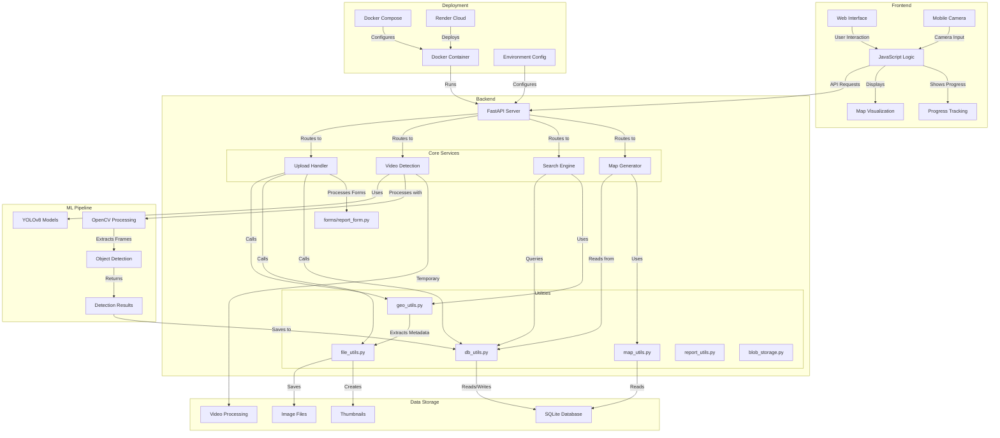

# Trash Detection App Architecture

## Overview
A FastAPI-based web application for reporting and tracking trash locations with **AI-powered video detection**, image uploads, GPS coordinates, and advanced geospatial analysis. The app features YOLOv8 integration for real-time trash detection in videos, mobile-optimized interfaces, and cloud deployment capabilities.

## Project Structure

```
TrashCollectionProject/
├── app.py                          # Main FastAPI application
├── requirements.txt                # Python dependencies
├── Dockerfile                      # Docker container configuration
├── docker-compose.yml             # Multi-container setup
├── render.yaml                    # Render deployment configuration
├── create_trash_dataset.py        # Database seeding and management
├── forms/
│   └── report_form.py            # Form processing utilities
├── map/
│   └── map_view.py               # Map visualization components
├── ml/
│   └── placeholder_model.py      # ML model placeholder
├── static/
│   ├── css/
│   │   ├── style.css             # Main stylesheet
│   │   └── modern-style.css      # Modern UI components
│   ├── js/
│   │   ├── app.js                # Main JavaScript logic
│   │   └── modern-app.js         # Modern JavaScript features
│   ├── images/                   # Static images
│   ├── index.html                # Main web interface
│   └── manifest.json             # PWA manifest
├── utils/
│   ├── database.py               # Database connection and models
│   ├── db_utils.py               # Database utility functions
│   ├── file_utils.py             # File handling utilities
│   ├── geo_functions.py          # Geospatial calculations
│   ├── geo_utils.py              # GPS and location utilities
│   ├── map_utils.py              # Map generation utilities
│   ├── report_utils.py           # Report processing utilities
│   └── blob_storage.py           # Object storage management
└── data/                         # Data storage directory
    ├── trash_reports.db          # SQLite database
    └── images/                   # Uploaded images
```

## System Design


```mermaid
graph TD
    %% Client Side
    subgraph "Frontend"
        UI[Web Interface]
        JS[JavaScript Logic]
        MAP[Map Visualization]
        PROGRESS[Progress Tracking]
        MOBILE[Mobile Camera]
    end

    %% Server Side
    subgraph "Backend"
        API[FastAPI Server]
        subgraph "Core Services"
            UPLOAD[Upload Handler]
            VIDEO[Video Detection]
            SEARCH[Search Engine]
            MAP_GEN[Map Generator]
        end
        subgraph "Utilities"
            GEO[geo_utils.py]
            FILE[file_utils.py]
            DB[db_utils.py]
            MAP_UTIL[map_utils.py]
            REPORT[report_utils.py]
            BLOB[blob_storage.py]
        end
        FORMS[forms/report_form.py]
    end

    %% ML Pipeline
    subgraph "ML Pipeline"
        YOLO[YOLOv8 Models]
        CV[OpenCV Processing]
        DETECT[Object Detection]
        RESULTS[Detection Results]
    end

    %% Storage
    subgraph "Data Storage"
        SQLITE[SQLite Database]
        IMAGES[Image Files]
        VIDEOS[Video Processing]
        THUMBNAILS[Thumbnails]
    end

    %% Deployment
    subgraph "Deployment"
        DOCKER[Docker Container]
        COMPOSE[Docker Compose]
        RENDER[Render Cloud]
        ENV[Environment Config]
    end

    %% Connections & Data Flow
    UI -->|User Interaction| JS
    JS -->|API Requests| API
    JS -->|Displays| MAP
    JS -->|Shows Progress| PROGRESS
    MOBILE -->|Camera Input| JS
    
    API -->|Routes to| UPLOAD
    API -->|Routes to| VIDEO
    API -->|Routes to| SEARCH
    API -->|Routes to| MAP_GEN
    
    UPLOAD -->|Calls| GEO
    UPLOAD -->|Calls| FILE
    UPLOAD -->|Calls| DB
    UPLOAD -->|Processes Forms| FORMS
    
    VIDEO -->|Uses| YOLO
    VIDEO -->|Processes with| CV
    CV -->|Extracts Frames| DETECT
    DETECT -->|Returns| RESULTS
    RESULTS -->|Saves to| DB
    
    SEARCH -->|Queries| DB
    SEARCH -->|Uses| GEO
    MAP_GEN -->|Reads from| DB
    MAP_GEN -->|Uses| MAP_UTIL
    
    GEO -->|Extracts Metadata| FILE
    DB -->|Reads/Writes| SQLITE
    FILE -->|Saves| IMAGES
    FILE -->|Creates| THUMBNAILS
    VIDEO -->|Temporary| VIDEOS
    MAP_UTIL -->|Reads| SQLITE
    
    DOCKER -->|Runs| API
    COMPOSE -->|Configures| DOCKER
    RENDER -->|Deploys| DOCKER
    ENV -->|Configures| API
```

## Component Description

### Frontend
- **Web Interface**: HTML/CSS interface for user interaction with responsive design
- **JavaScript Logic**: Handles form submission, file preview, map refresh, and video detection
- **Map Visualization**: Interactive Leaflet map showing trash data points with clustering
- **Progress Tracking**: Real-time feedback for video detection with timeout protection
- **Mobile Camera**: Native camera app integration for mobile video capture

### Backend
- **FastAPI Server**: Main application server handling requests with async support
- **Core Services**:
  - **Upload Handler**: Processes image uploads with GPS extraction
  - **Video Detection**: YOLOv8-powered video analysis pipeline
  - **Search Engine**: Geospatial search with dirtiness scoring
  - **Map Generator**: Dynamic map creation with Folium
- **Utilities**:
  - **geo_utils.py**: Extracts location metadata from images and handles GPS
  - **file_utils.py**: Handles file saving, processing, and thumbnail generation
  - **db_utils.py**: Manages database operations and queries
  - **map_utils.py**: Generates map visualizations and handles map data
  - **report_utils.py**: Processes and validates trash reports
  - **blob_storage.py**: Manages object storage (local/MinIO)

### ML Pipeline
- **YOLOv8 Models**: Pre-trained object detection models (YOLOv8n, YOLOv8s, YOLOv8m)
- **OpenCV Processing**: Video frame extraction and image processing
- **Object Detection**: Real-time trash identification with bounding boxes
- **Detection Results**: Aggregated results with confidence scores and classifications

### Data Storage
- **SQLite Database**: Lightweight database for metadata storage
- **Image Files**: Uploaded images stored in filesystem with thumbnails
- **Video Processing**: Temporary storage for video analysis
- **Thumbnails**: Auto-generated image thumbnails for performance

### Deployment
- **Docker Container**: Containerized application with optimized dependencies
- **Docker Compose**: Multi-container configuration for local development
- **Render Cloud**: Production deployment with auto-scaling
- **Environment Config**: Configuration management for different environments

## Data Flow

### Image Upload Flow
1. User uploads image via web interface
2. Frontend JavaScript sends data to `/upload` endpoint
3. Backend processes the data:
   - Extracts GPS metadata from image EXIF data
   - Saves image to storage with thumbnail generation
   - Updates database with metadata
4. Map is regenerated with new data point
5. Frontend displays updated map and confirmation

### Video Detection Flow
1. User uploads video and configures detection settings
2. Frontend sends video to `/detect-video` endpoint
3. Backend processes video:
   - Extracts frames at specified intervals
   - Runs YOLOv8 model on each frame
   - Aggregates detection results
   - Returns bounding boxes and classifications
4. Frontend displays results with progress tracking
5. User can submit detected trash locations

### Search Flow
1. User enters location in search bar
2. Frontend sends search request to `/api/find-dirty-places`
3. Backend processes search:
   - Geocodes address to coordinates
   - Queries database for nearby trash reports
   - Calculates dirtiness scores
   - Returns ranked results
4. Frontend displays results on map with markers

## API Endpoints

| Endpoint | Method | Description |
|----------|--------|-------------|
| `/` | GET | Serves the main web interface |
| `/upload` | POST | Handles image uploads with metadata |
| `/detect-video` | POST | Processes video with YOLOv8 detection |
| `/test-data` | POST | Adds test data without image |
| `/map` | GET | Returns HTML map visualization |
| `/api/trash-data` | GET | Returns JSON data for all entries |
| `/api/find-dirty-places` | GET | Searches for nearby trash locations |
| `/api/location-summary` | GET | Returns area statistics |
| `/api/image/{blob_id}` | GET | Serves images with optional thumbnails |

## ML Model Configuration

### YOLOv8 Models
- **YOLOv8n**: Fastest model, best for real-time processing
- **YOLOv8s**: Balanced speed and accuracy
- **YOLOv8m**: Most accurate, slower processing

### Detection Parameters
- **Frame Interval**: Number of frames to skip (higher = faster)
- **Confidence Threshold**: Minimum confidence for detections (higher = fewer false positives)
- **Model Selection**: Trade-off between speed and accuracy

## Performance Optimizations

### Video Processing
- Configurable frame intervals to reduce processing time
- Multiple model options for speed vs accuracy trade-offs
- Progress tracking with timeout protection
- Client-side fallback options for faster processing

### Database
- Indexed geospatial queries for fast location searches
- Thumbnail generation for faster image loading
- Efficient dirtiness scoring algorithm

### Frontend
- Responsive design for mobile devices
- Native camera integration for better mobile experience
- Real-time progress feedback for long-running operations

## Deployment Architecture

### Local Development
- SQLite database for simplicity
- Local file storage
- Single server deployment
- Development-friendly configuration

### Production (Render)
- Persistent storage for database and images
- Environment variable configuration
- Auto-deployment from GitHub
- Health checks and monitoring
- Optimized Docker container with system dependencies

## Security Considerations

- File upload validation and sanitization
- SQL injection prevention through ORM
- CORS configuration for API access
- Environment variable management for sensitive data
- Input validation and error handling

## Monitoring and Logging

- Application logs for debugging
- Performance metrics for video processing
- Error tracking and reporting
- Database query optimization
- User interaction analytics
